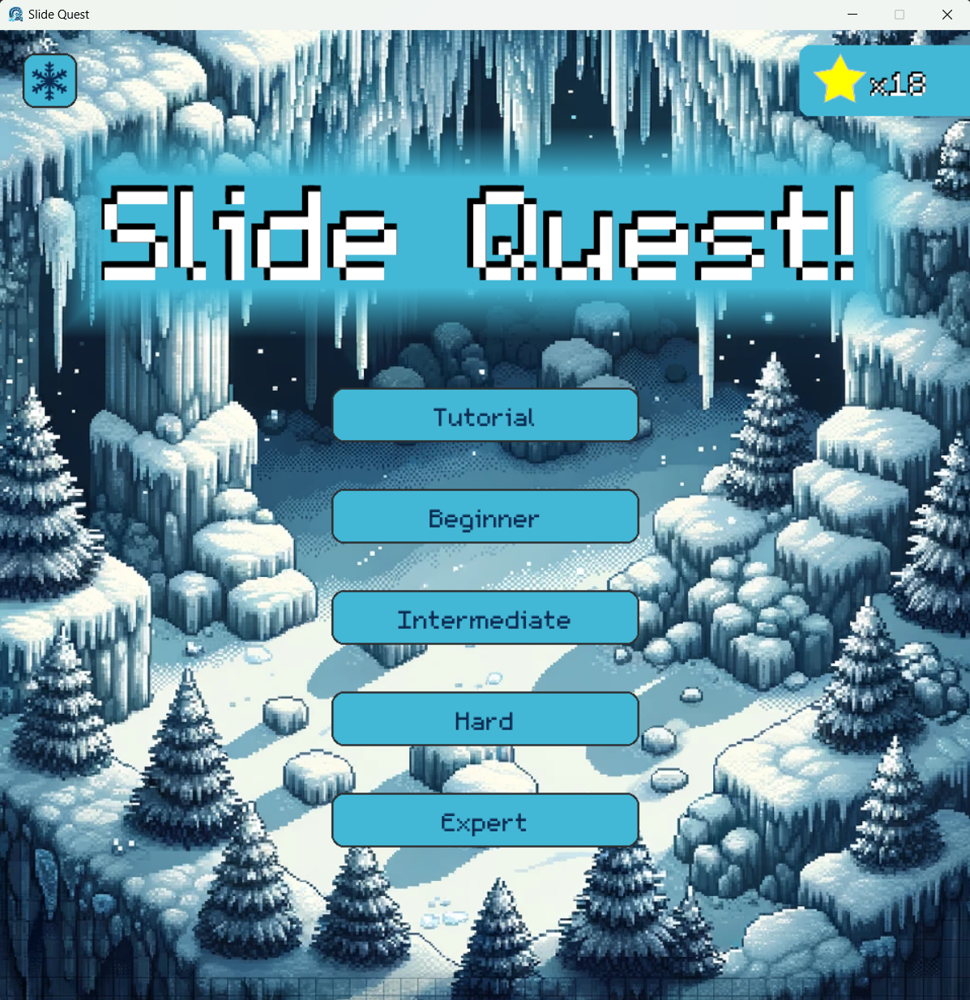
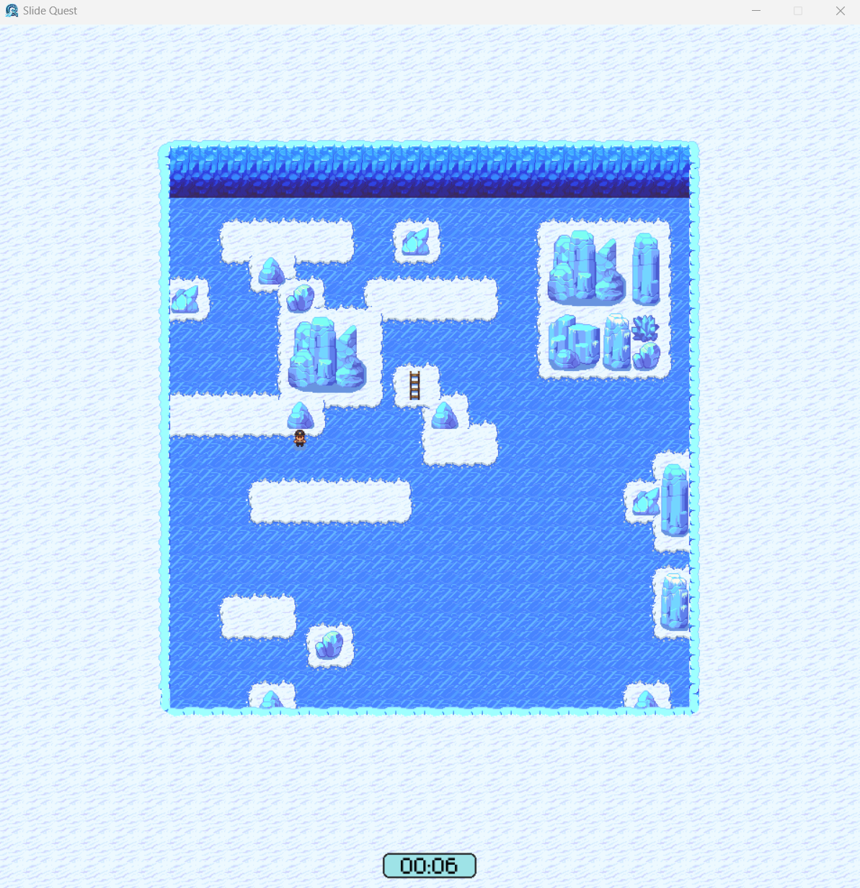

https://img.shields.io/badge/any_text-you_like-blue

# Slide-Quest

[Install Instructions](#install-instructions).

A fun puzzle game where you slide around to escape the cave. 

Python 3.11.9

#### Title Screen
- Earn stars by playing the game.
- Harder difficulty means larger map.

#### Gameplay
- Use the arrow keys or wasd to move towards the ladder.
- You will slide over the ice until you hit the wall or an ice sculpture. 
- Snow will stop your momentum and allow you to change direction.

#### Level Completion
- Earn stars by completing levels in the least number of moves and the least time

# Install Instructions

### Windows
1. Go to releases/tags page [here](https://github.com/mschmidlin1/slide-quest/releases "Title") and download the latest zip file.
2. Unzip folder to desired location.
3. Run game by double clicking on "SlideQuest.exe"
4. Note - the game must be in the the same location as the resources folder so if you move the game the resources folder must go with it. 

### Mac
1. Go to releases/tags page [here](https://github.com/mschmidlin1/slide-quest/releases "Title") and download the latest zip file.
2. Unzip folder
3. Run Install.sh from the command line using the following command `./Install.sh` (this moves the game and resources to your home folder on Mac) (this must be run from the same directory as the script!)
4. Navigate to your home folder and run either SlideQuest or SlideQuest-Intel. You can double click them in finder or run them with `./SlideQuest` or `./SlideQuest-Intel`.

# Uninstall Instructions

### Windows
1. Delete folder containing game and resources.

### Mac
1. Run CleanUp.sh from the command line using the following command `./CleanUp.sh`. This should be run from the original download directory where you stored the zip file.
2. Delete the downloaded zip file.
